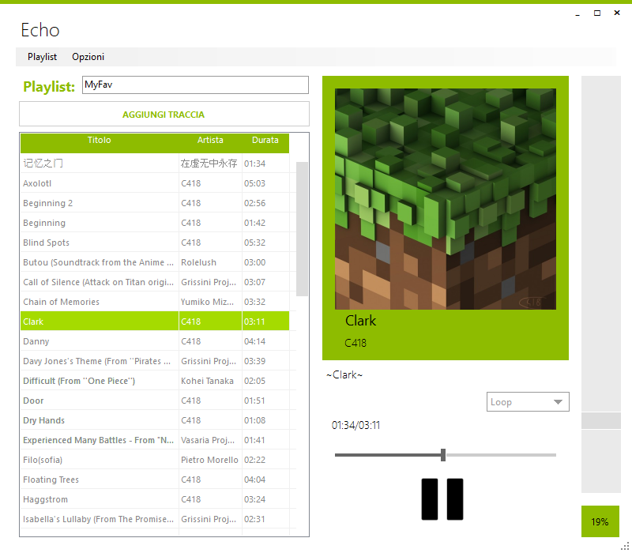
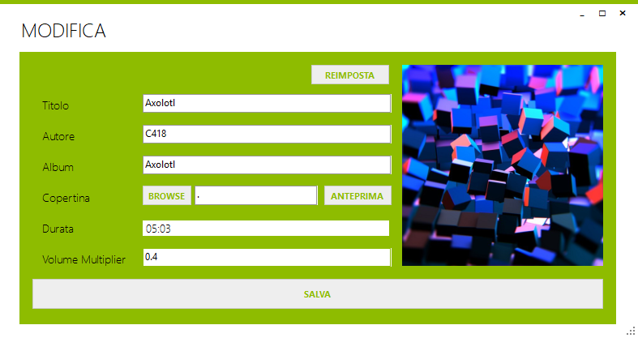
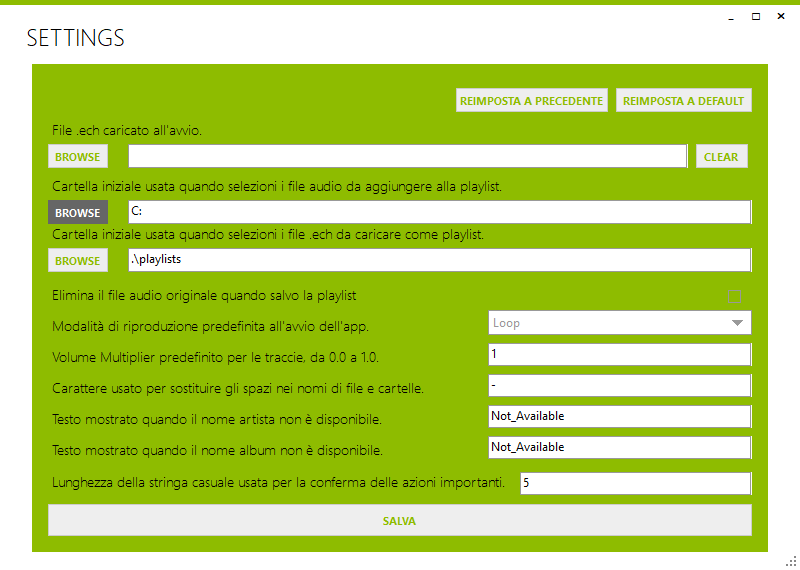

# Echo — Player MP3 locale

Mi stavo stancando dell'utilizzo di Spotify: lo usavo solo per ascoltare le solite canzoni e spesso venivo interrotto dalle pubblicità.
Per questo, e anche in vista di un progetto scolastico, ho deciso di realizzare un'alternativa costruita su misura per le mie esigenze: **Echo**, un player desktop per gestire playlist locali, riprodurre MP3, modificare metadati e salvare raccolte in formato dedicato `.ech`.

            
## Funzionalità principali

- **Riproduzione Audio:** Supporto per file MP3 con controlli di riproduzione (Play, Pause, Stop) e seek tramite barra di avanzamento.
- **Gestione Playlist:** Aggiunta di brani locali, rimozione, svuotamento playlist (con conferma di sicurezza) e navigazione libera.
- **Modalità di Riproduzione:** Singola (Single), Ripetizione (Loop) e Casuale (Shuffle).
- **Controllo Volume Avanzato:** Volume globale dell'app e moltiplicatore di volume salvabile per singola traccia, per livellare l'audio tra brani diversi.
- **Modifica Metadati (Tag ID3):** Lettura e modifica di Titolo, Artista, Album e Copertina direttamente dall'app, con salvataggio nei file `.mp3`.
- **Formato Proprietario `.ech`:** Salvataggio delle playlist in cartelle dedicate contenenti i file audio copiati (o spostati) e un file di indice `.ech` per preservare l'ordine e il volume personalizzato.
- **Impostazioni Persistenti:** Configurazione delle directory predefinite, comportamento sui file originali e caricamento automatico di una playlist all'avvio.

## Anteprima schermate

|  |  |
|:---:|:---:|
| *Finestra di modifica metadati e copertina* | *Finestra delle impostazioni dell'app* |

## Come si usa

1. **Avvio:** Apri Echo. Se configurato nelle impostazioni, caricherà in automatico l'ultima playlist.
2. **Aggiungere brani:** Clicca sul pulsante "+ Aggiungi" per importare file MP3 dal tuo PC.
3. **Riproduzione:** Seleziona un brano dalla lista e premi il tasto Play. Usa la barra per andare avanti/indietro.
4. **Modifica:** Usa l'opzione di modifica per cambiare i tag del brano (Titolo, Autore, Copertina) o il volume specifico.
5. **Salvataggio:** Clicca sul comando "Salva" per esportare la playlist in una cartella autonoma `.ech`. Al caricamento successivo, i dati modificati saranno ripristinati.

## Struttura del Progetto

Il progetto è organizzato nei seguenti moduli:
- **`Forms/`**: Interfacce grafiche utente (finestra principale, dialoghi, impostazioni e modifica brano).
- **`AudioTrackClasses/`**: Modello dati delle tracce, stato riproduzione, lettura/scrittura metadati ID3 e file `.ech`.
- **`Helpers/`**: Classi di utilità per matematica, formattazione stringhe e UI.
- **`Resources/`**: Risorse grafiche e icone dell'applicazione.
- **`AppConfigs/`**: File di configurazione dell'applicazione.

## Tecnologie e Librerie

Sviluppato in **C# 7.3** su piattaforma **Windows Forms (.NET Framework 4.8)**.

- **UI**: [ReaLTaiizor](https://github.com/Taiizor/ReaLTaiizor.git) (stile moderno e personalizzabile).
- **Audio**: [NAudio](https://github.com/naudio/NAudio.git) (decodifica e interfacciamento dispositivi audio).
- **Metadati**: [taglib-sharp](https://github.com/mono/taglib-sharp.git) (lettura/scrittura tag ID3 in C#).

## Licenza

Distribuito sotto licenza MIT. Vedi [LICENSE](LICENSE) per i dettagli.